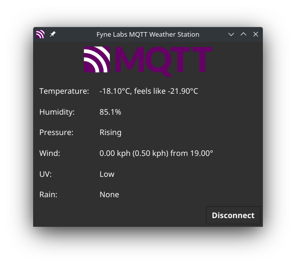

# MQTT Weather demo app

A demo of using MQTT bindings with Fyne and Go to show weather data of a
remote monitoring station.

## Screenshot

## How to test

Connect mqttweather to broker.emqx.io and then send the following command.

    mosquitto_pub -h broker.emqx.io -t "homeassistant/sensor/weatherflow2mqtt_ST-42/status/attributes" -m '{"attribution": "Powered by WeatherFlow2MQTT"}'
    mosquitto_pub -h broker.emqx.io -t "homeassistant/sensor/weatherflow2mqtt_ST-42/observation/state" -m '{"absolute_humidity": 2.45, "air_density": 1.19, "air_temperature": -7.7, "battery": 2.58, "battery_level": 78, "battery_mode_description": "All sensors enabled and operating at full performance. Wind sampling interval every 3 seconds", "battery_mode": 0, "beaufort_description": "Calm", "beaufort": 0, "delta_t": 0.5, "dewpoint": -9.1, "dewpoint_description": "Dry", "feelslike": -10.9, "illuminance": 3698, "lightning_strike_count": 0, "lightning_strike_count_1hr": 0, "lightning_strike_count_3hr": 0, "lightning_strike_count_today": 0, "lightning_strike_distance": 0, "lightning_strike_energy": 0, "lightning_strike_time": "1970-01-01T00:00:00+00:00", "precipitation_type": "None", "rain_duration_today": 0, "rain_duration_yesterday": 0, "rain_intensity": "None", "rain_rate": 0, "rain_start_time": "2021-12-11T21:28:31+00:00", "rain_today": 0.0, "rain_yesterday": 0.0, "relative_humidity": 88.23, "sealevel_pressure": 995.47, "solar_radiation": 31, "station_pressure": 904.31, "status": 10149130, "temperature_description": "Fridged", "uv": 0.02, "uv_description": "Low", "visibility": 6.5, "wbgt": -10.2, "wetbulb": -8.2, "wind_bearing": 0, "wind_bearing_avg": 0, "wind_direction": 0, "wind_direction_avg": "N", "wind_gust": 0.0, "wind_lull": 0.0, "wind_speed": 0.0, "wind_speed_avg": 0.0, "pressure_trend": "Falling", "pressure_trend_value": -2.23, "last_reset_midnight": "2021-12-22T07:00:00+00:00"}'

